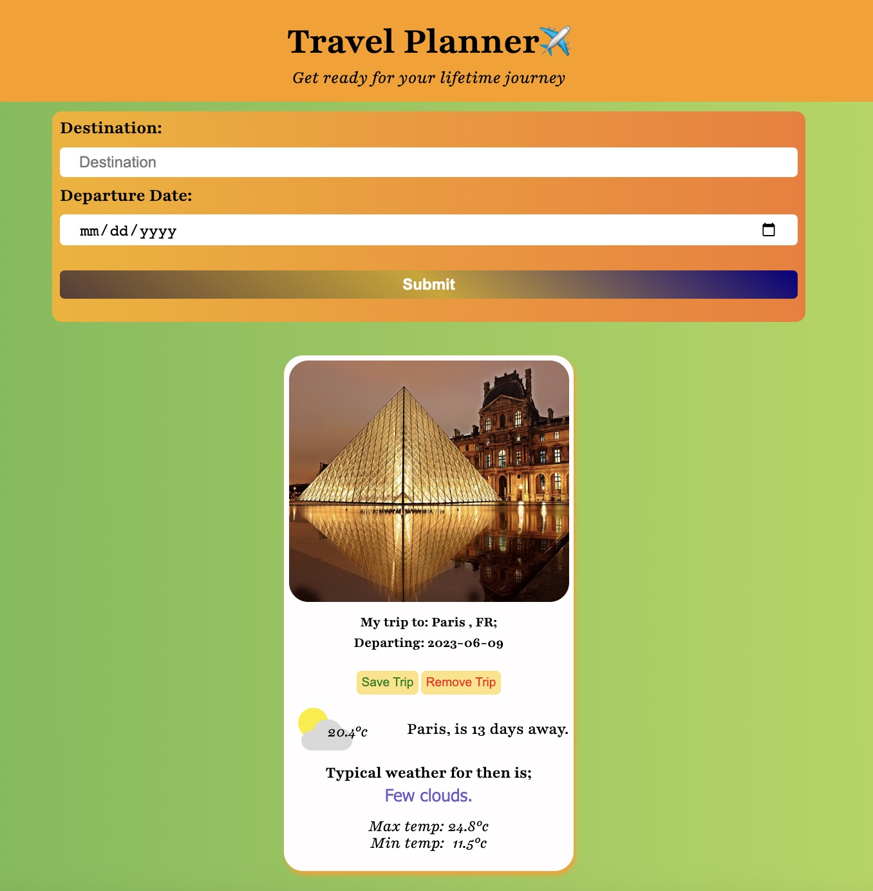
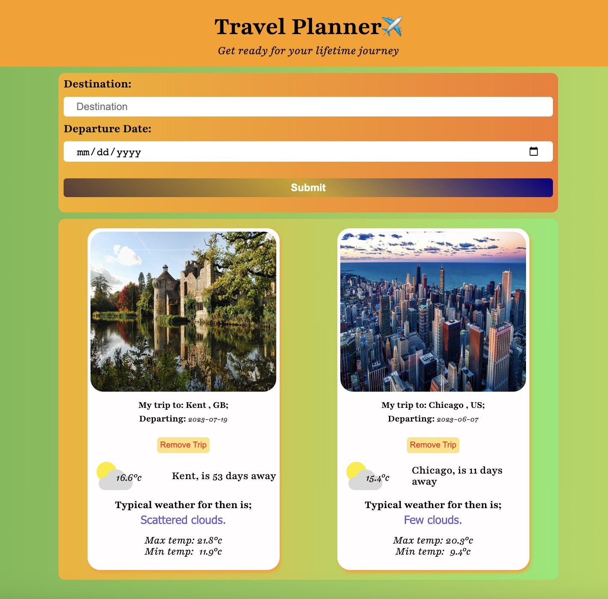
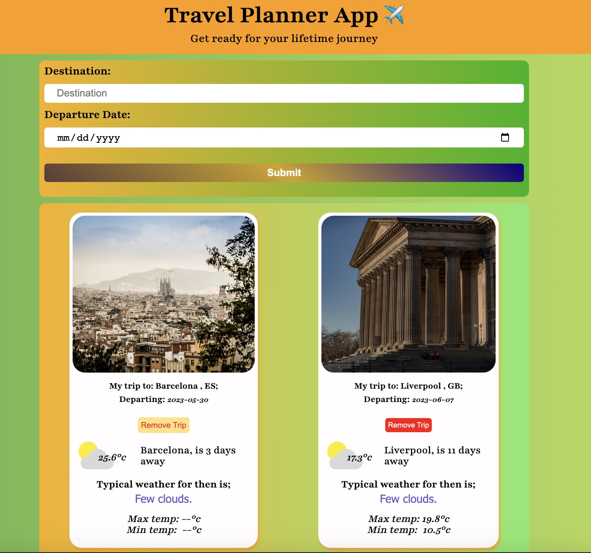

# Travel Planner Application

The Travel Planner application lets users enter a city (destination) and a date (travel date) to retrieve weather information and images. It connects to three different APIs to display the weather condition and an image related to the location.

## Features:

1. Search for destinations and view relevant information.
2. Get current weather conditions and forecasts.
3. See beautiful image related to your chosen destination.
4. Plan and save your trips with details.
5. Countdown to your trip start date.
6. Responsive design for different devices.

### Technologies Used:

1. HTML
2. CSS
3. JavaScript
4. Express

### APIs used in the project

1. Pixabay
2. Openweather
3. Weatherbit

## Using the application on your local system

- clone the repo using git clone https://github.com/lumidee007/travel-planner.git
- run npm install
- run run start for the production build
- visit http://localhost:1922/ to access the application.

# Setup project environment [ dependencies & devDependencies ]

## dependencies

- express
- webpack
- webpack-cli
- cors
- esm
- file-loader
- jest-webpack

## devDependencies

- babel/core
- babel/preset-env
- babel-loader
- clean-webpack-plugin
- css-loader
- html-webpack-plugin
- jest
- jest-webpack
- mini-css-extract-plugin
- node-sass
- optimize-css-assets-webpack-plugin
- sass-loader
- style-loader
- terser-webpack-plugin
- webpack-dev-server
- workbox-webpack-plugin

# Config

- webpack.dev.js for development mode. 'npm run build-dev' run the script and also start the webpack dev server.
- webpack.prod.js for production mode. 'npm run build-prod' run the script to generate a dist folder.
- npm run start: starts the server on port 1990.
- npm run test: run jest to test the js function.

# Offline functionality

- service workers in webpack is installed to ensure site is available even when the local server stop running.
